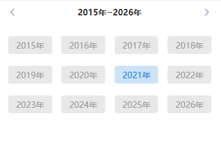
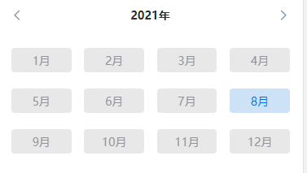
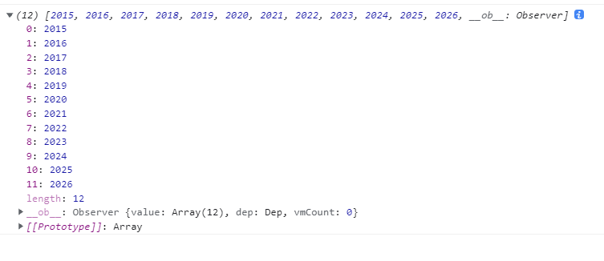
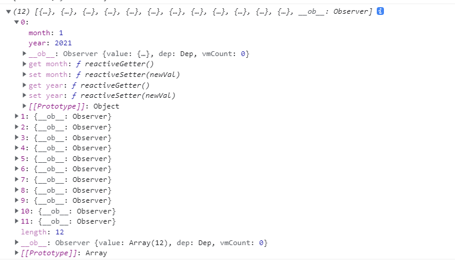
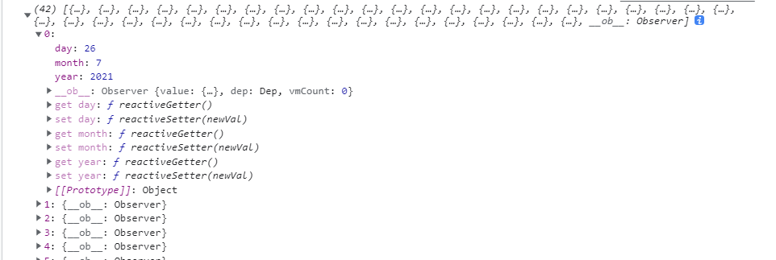

<!-- <ClientOnly>
  <componentsMobile-timePicker-demo />
</ClientOnly> -->

#### 代码演示


``` html
      <time-picker 
      :dialogVisible="true" 
      timeType="datetime" 
      :timeData="[2021,8,5]" 
      :disabledDate="disabledDate" 
      @submit="submit">
      </time-picker>
```

``` js
    export default {
        data(){
            return{

            }
        },
        mounted(){

        },
        methods:{
          disabledDate(time){
            return new Date(time).getTime() < new Date("2021/9/1").getTime()
          },
          submit(value){
            console.log(value)
          },
        }
    }
```
<!-- #### 日期选择器.vue -->
#### 属性

|参数|说明|类型|默认值|是否必填|
| ----- | ----- | ----- | ----- | ----- |
|dialogVisible|显示隐藏|Boolean|true|否|
|timeType|时间类型|String|datetime|是|
|timeData|进入的时间|Array|当前的年月日|是|
|disabledDate|不可选日期|Function|function() { return false }|否|


#### timeType 可选值

##### timeType="year"
<p style="text-align: center;">
  
</p>

##### timeType="month"
<p style="text-align: center;">
  
</p>

##### timeType="datetime"
<p style="text-align: center;">
  
</p>

##### submit 事件

|事件名|说明|回调参数|
| ----- | ----- | ----- |
|submit|选中返回函数|value(选中返回的数据)|


##### Form Methods

|方法名|说明|参数|
| ----- | ----- | ----- |
|monthlyCalendar|传入时间后得到对应时间数组数据|function(type,year,month)|

``` js
  monthlyCalendar(type,year,month){
      let date = new Date();
      // 前一个，当前，后一个 
      let monthBeforeList = []
      let actualDayList = []
      let nextMonthList = [] 
      if(type == 'datetime'){
          //前一个后一个截取的数组
          let monthBeforeIntercept = []
          let actualDayListIntercept = []
          let nextMonthIntercept = []
          let monthBefore = (new Date(year,month - 1,0)).getDate() //前一个月天数
          let actualDay = (new Date(year,month,0)).getDate() // 当前月天数
          this.actualDay = actualDay
          let nextMonth = (new Date(year,month + 1,0)).getDate() //后一个月天数
          let weeks = [7,1,2,3,4,5,6]
          for(let i = 1;i<monthBefore + 1;i++){
            let obj = {
              day:i,
              month:month - 1,
              year:year,
              disabled:typeof this.disabledDate === 'function' && this.disabledDate(new Date(year,month - 2,i)),
            }
            monthBeforeList.push(obj)
          }
          for(let i = 1;i<actualDay + 1;i++){
            let obj = {
              day:i,
              month:month,
              year:year,
              disabled:typeof this.disabledDate === 'function' && this.disabledDate(new Date(year,month - 1,i)),
            }
            actualDayList.push(obj)
          }
          for(let i = 1;i<nextMonth + 1;i++){
            let obj = {
              day:i,
              month:month + 1,
              year:year,
              disabled:typeof this.disabledDate === 'function' && this.disabledDate(new Date(year,month,i)),
            }
            nextMonthList.push(obj)
          }
          let dt_first = weeks[(new Date(year,month - 1,1)).getDay()] //当月第一天是周几 weeks[dt_first]
          monthBeforeIntercept = monthBeforeList.slice(monthBefore - (dt_first - 1))
          nextMonthList = nextMonthList.slice(0, 42 - actualDay - monthBeforeIntercept.length)
          actualDayListIntercept = [...monthBeforeIntercept,...actualDayList,...nextMonthList]
          return actualDayListIntercept
      }else if(type == 'year'){
        let yearNUm = {
          year:year,
          disabled:typeof this.disabledDate === 'function' && this.disabledDate(new Date(String(year))),
        }
        if(new Date().getFullYear() == year){
          yearNUm.year = year - 6
          yearNUm.disabled = typeof this.disabledDate === 'function' && this.disabledDate(new Date(String(yearNUm.year)))
        }
        for(let i = 0;i<12;i++){
          let obj = {
            year:yearNUm.year + i,
            disabled: typeof this.disabledDate === 'function' && this.disabledDate(new Date(String(yearNUm.year + i)))
          }
          actualDayList.push(obj)
        }
        return actualDayList
      }else{
        let monthList = [1,2,3,4,5,6,7,8,9,10,11,12]
        for(let i = 1;i<monthList.length + 1;i++){
          let obj = {
            month:i,
            year:year,
            disabled:typeof this.disabledDate === 'function' && this.disabledDate(new Date(year,i - 1))
          }
          actualDayList.push(obj)
        }
        return actualDayList
      }
    }
```

#### timeType 数据

##### timeType="year"
<p style="text-align: center;">
  
</p>

##### timeType="month"
<p style="text-align: center;">
  
</p>

##### timeType="datetime"
<p style="text-align: center;">
  
</p>