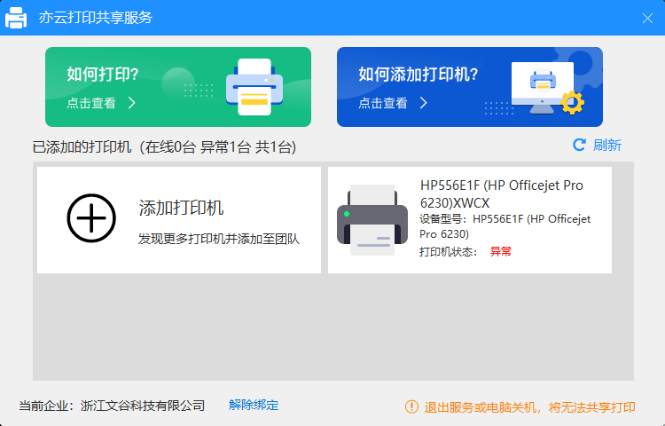

接口新增
common模块新增两个接口

/Common/User/GetCloudPrinterList 获取打印机列表
/Common/User/OpenPrint 打印

前置条件
安装亦云打印共享服务，安装地址如下
<a href="https://dl-setup.effio.cn/service/yiyun-print.exe" target="_blank">https://dl-setup.effio.cn/service/yiyun-print.exe</a>

打开如下

<p style="text-align: center;">
  
</p>

如果该企业无他人绑定打印机，默认为空，同一企业数据共通，无人员概念

云打印使用时需打开共享服务

页面调用
此处为个人分装组件

获取打印机列表接口request封装名为GetCloudPrinterList，打印接口request封装名为postOpenPrint


``` html
<template>
  <div :class="['choose-dialog', dialogVisible ? 'is-show' : '']">
    <my-head :headState="1" @backFun="closeDialog" title="云打印"></my-head>
    <template v-if="listData.length > 0 && chooseObj.id">
      <scroll
        ref="scroll"
        class="scroll"
        :probeType="3"
        :scrollbar="false"
        :click="true"
      >
        <div class="scroll-first-div">
          <div class="printer-list" @click="showPrinterListFun">
            <i class="iconfont printicon"></i>
            <div class="printer-name">{{ chooseObj.name }}</div>
            <i class="iconfont righticon"></i>
          </div>
          <div class="common-list">
            <div class="common-list-left">打印份数</div>
            <div class="common-list-right">
              <i
                class="iconfont lefticon"
                :style="pageNum <= 1 ? 'color: #b9c5d2;' : ''"
                @click="subFun"
                ></i
              >
              <input
                type="text"
                maxlength="4"
                v-model="pageNum"
                @input="pageNumInput"
              />
              <i
                class="iconfont righticon"
                :style="pageNum >= 500 ? 'color: #b9c5d2;' : ''"
                @click="addFun"
                ></i
              >
            </div>
          </div>
          <div class="common-list" @click="showPageSizeFun">
            <div class="common-list-left">纸张尺寸</div>
            <div class="common-list-right">
              <span>{{ pageSize }}</span>
              <i class="iconfont"></i>
            </div>
          </div>
          <template v-if="pageSize === '自定义'">
            <div class="custom-list">
              <div class="custom-left">
                <p>
                  宽度：<span>{{ width }}</span
                  >mm
                </p>
                <p>
                  高度：<span>{{ height }}</span
                  >mm
                </p>
              </div>
              <div class="custom-right" @click="editFun">编辑</div>
            </div>
          </template>
          <div class="common-list">
            <div class="common-list-left">单/双面</div>
            <div class="common-list-right">
              <my-switch
                :value="isDouble"
                leftText="双面"
                rightText="单面"
                showText
                @toggle="toggleFun"
                type="large"
                v-if="chooseObj.pageSide === 1"
              ></my-switch>
              <template v-else>
                <span>单面</span>
              </template>
            </div>
          </div>
          <div class="common-list">
            <div class="common-list-left">色彩</div>
            <div class="common-list-right">
              <my-switch
                :value="isColours"
                leftText="彩色"
                rightText="黑白"
                showText
                @toggle="toggleFun2"
                type="large"
                v-if="chooseObj.color === 1"
              ></my-switch>
              <template v-else>
                <span>黑白</span>
              </template>
            </div>
          </div>
        </div>
      </scroll>
      <div class="print-footer">
        <div class="confirm-button" @click="printFun">立即打印</div>
      </div>
    </template>
    <template v-else>
      <no-list
        title="暂无打印机列表"
        content="请开启亦云打印共享服务并添加打印机"
        v-if="listData.length === 0"
      ></no-list>
      <no-list
        title="暂无打印机在线"
        content="请检查是否开启亦云打印共享服务并启动至少一台打印机"
        v-else
      ></no-list>
    </template>

    <!-- 打印机列表 -->
    <van-action-sheet v-model="showPrinterList" cancel-text="取消">
      <div class="choose-title">选择打印机</div>
      <div class="choose-lists">
        <template v-for="item in listData">
          <div :key="item.id" class="choose-list" @click="choosePrinter(item)">
            <i
              class="iconfont printicon"
              :style="item.status ? '' : 'color: #b9c5d2'"
              ></i
            >
            <div class="printer-box">
              <div class="printer-name">{{ item.name }}</div>
              <div class="printer-else">
                {{ item.color === 1 ? "彩色" : "黑白" }} 
                {{ item.pageSizes.join("/") }} 
                {{ item.pageSide === 1 ? "双面" : "单面" }}
              </div>
            </div>
            <i class="iconfont righticon" v-if="item.id === chooseObj.id"
              ></i
            >
          </div>
        </template>
      </div>
    </van-action-sheet>
    <!-- 纸张尺寸 -->
    <van-action-sheet v-model="showPageSize">
      <van-picker
        title="纸张尺寸"
        show-toolbar
        :columns="chooseObj.pageSizes"
        item-height="2.2rem"
        @confirm="pageSizeConfirm"
        @cancel="showPageSize = false"
        :default-index="chooseObj.pageSizes.indexOf(pageSize)"
      />
    </van-action-sheet>
    <!-- 自定义尺寸框 -->
    <van-dialog
      v-model="showCustomSize"
      show-cancel-button
      @confirm="customConfirm"
    >
      <div class="dialog-content">
        <div class="dialog-title">自定义页面大小尺寸</div>
        <div class="dialog-list" style="margin-bottom: 0.5rem">
          <span>宽度(W)：</span>
          <input
            type="text"
            maxlength="3"
            v-model="customWidth"
            @input="widthInput"
          />
          <span>mm</span>
        </div>
        <div class="dialog-list">
          <span>高度(H)：</span>
          <input
            type="text"
            maxlength="3"
            v-model="customHeight"
            @input="heightInput"
          />
          <span>mm</span>
        </div>
      </div>
    </van-dialog>
  </div>
</template>
<script>
import { mapGetters, mapMutations, mapActions } from "vuex";

export default {
  name: "CloudPrint",
  props: {
    // 组件展示/隐藏
    dialogVisible: {
      type: Boolean,
      default: false,
    },
    // 打印链接
    printUrl: {
      type: String,
      default: "",
    },
    // 打印名称
    printName: {
      type: String,
      default: "",
    },
  },
  data() {
    return {
      // 打印份数
      pageNum: 1,
      // 选中纸张大小
      pageSize: "",
      // 是否单双面
      isDouble: false,
      // 是否彩色
      isColours: false,
      // 展示打印机选择
      showPrinterList: false,
      // 展示纸张大小选择
      showPageSize: false,
      // 自定义宽
      width: 58,
      // 自定义高
      height: 84,
      // 自定义尺寸框
      showCustomSize: false,
      // 自定义宽
      customWidth: "",
      // 自定义高
      customHeight: "",

      // 打印机信息
      listData: [],
      chooseObj: { id: "", pageSizes: [], pageSide: 0, color: 0 },
    };
  },
  watch: {
    async dialogVisible(judge) {
      try {
        if (judge) {
          this.init();
          this.$store.commit("loadShowFun", true);
          await this.GetCloudPrinterListFun();
          this.$store.commit("loadShowFun", false);
        }
      } catch (error) {
        this.$store.commit("loadShowFun", false);
        console.log(error);
      }
    },
  },
  methods: {
    ...mapMutations([]),
    ...mapActions(["GetCloudPrinterList", "postOpenPrint"]),
    // 关闭
    closeDialog(callback) {
      callback(true);
      this.$emit("closeDialog");
    },
    // 初始化数据
    init() {
      this.chooseObj = { id: "", pageSizes: [], pageSide: 0, color: 0 };
      this.showPrinterList = false;
      this.howPageSize = false;
      this.listData = [];
      this.pageNum = 1;
      this.pageSize = "";
      this.isDouble = false;
      this.isColours = false;
      this.width = 58;
      this.height = 84;
    },
    // 输入
    pageNumInput() {
      this.pageNum = this.pageNum.replace(/[^0-9]/g, "");
      if (!this.pageNum) {
        this.pageNum = 1;
      } else if (this.pageNum > 500) {
        this.pageNum = 500;
      }
    },
    // 减
    subFun() {
      if (this.pageNum > 1) {
        this.pageNum--;
      }
    },
    // 加
    addFun() {
      if (this.pageNum < 500) {
        this.pageNum++;
      }
    },
    // 开关是否单双面
    toggleFun(value) {
      this.isDouble = value;
    },
    // 开关是否彩色/黑白
    toggleFun2(value) {
      this.isColours = value;
    },
    // 打开选择打印机
    async showPrinterListFun() {
      await this.$utils.sleep(100);
      this.showPrinterList = true;
    },
    // 打开纸张选择
    async showPageSizeFun() {
      await this.$utils.sleep(100);
      this.showPageSize = true;
    },
    // 纸张尺寸确认
    pageSizeConfirm(value) {
      this.pageSize = value;
      this.showPageSize = false;
    },
    // 选择打印机
    choosePrinter(item) {
      if (this.chooseObj.id === item.id) {
        return;
      }
      if (item.status === 0) {
        return this.$toast("该打印机已离线");
      } else {
        this.chooseObj = item;
        if (!this.chooseObj.pageSizes.includes("自定义")) {
          this.pageSize = this.chooseObj.pageSizes[0];
        }
        this.showPrinterList = false;
      }
    },
    // 编辑自定义宽高
    async editFun() {
      this.customWidth = this.$_.cloneDeep(this.width);
      this.customHeight = this.$_.cloneDeep(this.height);
      await this.$utils.sleep(100);
      this.showCustomSize = true;
    },
    // 宽度输入
    widthInput() {
      this.customWidth = this.customWidth.replace(/[^0-9]/g, "");
      if (!this.customWidth) {
        this.customWidth = 1;
      } else if (this.customWidth > 420) {
        this.customWidth = 420;
      }
    },
    // 高度输入
    heightInput() {
      this.customHeight = this.customHeight.replace(/[^0-9]/g, "");
      if (!this.customHeight) {
        this.customHeight = 1;
      } else if (this.customHeight > 297) {
        this.customHeight = 297;
      }
    },
    customConfirm() {
      this.width = this.$_.cloneDeep(this.customWidth);
      this.height = this.$_.cloneDeep(this.customHeight);
    },
    // 获取打印机列表
    async GetCloudPrinterListFun() {
      try {
        let res = await this.GetCloudPrinterList();
        this.listData = res.data;
        if (this.listData.length > 0) {
          this.listData.forEach((item) => {
            if (item.pageSizes.includes("Custom")) {
              let index = item.pageSizes.indexOf("Custom");
              item.pageSizes.splice(index, 1, "自定义");
            }
          });
          let index = -1;
          for (let i = 0; i < this.listData.length; i++) {
            if (this.listData[i].status === 1) {
              index = i;
              break;
            }
          }
          if (index > -1) {
            this.chooseObj = this.listData[index];
            this.pageSize = this.chooseObj.pageSizes.includes("自定义")
              ? "自定义"
              : this.chooseObj.pageSizes[0];
          }
        }
      } catch (error) {
        this.$store.commit("loadShowFun", false);
        console.log(error);
      }
    },
    // 打印
    async printFun() {
      try {
        if (!this.isSubmit) {
          this.isSubmit = true;
          this.$store.commit("loadShowFun", true);
          await this.postOpenPrint({
            printerId: this.chooseObj.id,
            files: [
              {
                file: this.printUrl,
                fileName: this.printName,
                color: this.chooseObj.color === 0 ? 0 : this.isColours ? 1 : 0,
                pageSide:
                  this.chooseObj.pageSide === 0 ? 0 : this.isDouble ? 1 : 0,
                copies: Number(this.pageNum),
                pageSize: this.pageSize === "自定义" ? "Custom" : this.pageSize,
                width: this.pageSize === "自定义" ? Number(this.width) : 0,
                height: this.pageSize === "自定义" ? Number(this.height) : 0,
              },
            ],
          });
          this.$store.commit("loadShowFun", false);
          this.isSubmit = false;
          this.$toast("打印指令发送成功，请前往打印机查看");
          this.$emit("closeDialog");
        }
      } catch (error) {
        this.isSubmit = false;
        this.$store.commit("loadShowFun", false);
        console.log(error);
      }
    },
  },
  computed: {
    ...mapGetters([]),
  },
};
</script>
<style lang="scss" scoped>
.is-show {
  right: 0 !important;
}
.choose-dialog {
  background: #fafafa;
  transition: 0.5s;
  position: absolute;
  height: 100%;
  width: 100%;
  top: 0;
  z-index: 111;
  right: -100%;

  .scroll {
    height: calc(100% - 5.2rem);

    .printer-list {
      height: 3rem;
      margin-bottom: 10px;
      padding: 0 16px;
      background-color: #fff;
      display: flex;
      align-items: center;

      .printicon {
        color: #036ed5;
        font-size: 1.2rem;
        margin-right: 5px;
      }
      .printer-name {
        flex: 1;
        font-size: 16px;
        font-family: PingFangSC-Regular, PingFang SC;
        font-weight: 400;
        color: #303133;
        line-height: 20px;
        @extend .ellipsis;
      }
      .righticon {
        font-size: 0.8rem;
        color: #b9c5d2;
        margin-left: 5px;
      }
    }
    .common-list {
      display: flex;
      align-items: center;
      height: 44px;
      background: #ffffff;
      border-bottom: 1px solid #ebedf0;
      padding: 0 10px;

      .common-list-left {
        font-size: 14px;
        font-family: PingFangSC-Regular, PingFang SC;
        font-weight: 400;
        color: #303133;
        line-height: 18px;
      }
      .common-list-right {
        display: flex;
        align-items: center;
        flex: 1;
        overflow: hidden;
        justify-content: flex-end;

        span {
          font-size: 14px;
          font-family: PingFangSC-Regular, PingFang SC;
          font-weight: 400;
          color: #606266;
          line-height: 18px;
          margin-right: 4px;
        }
        i {
          font-size: 0.8rem;
          color: #b9c5d2;
        }
        .lefticon,
        .righticon {
          font-size: 1.2rem;
          color: #036ed5;
        }
        input {
          width: 50px;
          height: 26px;
          border: 1px solid #ebedf0;
          text-align: center;
          margin-left: 5px;
          margin-right: 5px;
          border-radius: 2px;
        }
      }
    }
    .custom-list {
      height: 60px;
      display: flex;
      align-items: center;
      background: #ffffff;
      border-bottom: 1px solid #ebedf0;
      padding: 0 16px 0 25px;

      .custom-left {
        flex: 1;
        overflow: hidden;

        p {
          font-size: 12px;
          font-family: PingFangSC-Regular, PingFang SC;
          font-weight: 400;
          color: #606266;
          line-height: 18px;

          span {
            font-size: 12px;
            font-family: PingFangSC-Regular, PingFang SC;
            font-weight: 400;
            color: #606266;
            line-height: 18px;
          }
        }
      }
      .custom-right {
        width: 56px;
        height: 26px;
        font-size: 12px;
        font-family: PingFangSC-Regular, PingFang SC;
        font-weight: 400;
        color: #036ed5;
        line-height: 18px;
        border-radius: 13px;
        display: flex;
        align-items: center;
        justify-content: center;
        border: 1px solid #036ed5;
      }
    }
  }
  .print-footer {
    position: relative;
    background-color: #ffffff;
    height: 3rem;
    width: 100%;
    display: flex;
    align-items: center;
    justify-content: center;
    padding: 0 0.8rem;
    box-shadow: 0 -0.2rem 0.2rem 0 rgba(0, 0, 0, 0.05);

    .confirm-button {
      width: 100%;
      height: 2rem;
      background-color: #036ed5;
      border-radius: 0.2rem;
      color: #fff;
      display: flex;
      align-items: center;
      justify-content: center;
    }
  }
  .choose-title {
    height: 40px;
    width: 100%;
    display: flex;
    align-items: center;
    justify-content: center;
    border-bottom: 1px solid #ebedf0;
    font-size: 16px;
    font-family: PingFangSC-Regular, PingFang SC;
    font-weight: 400;
    color: #303133;
    line-height: 18px;
  }
  .choose-lists {
    max-height: 14.4rem;
    overflow: auto;

    &::-webkit-scrollbar {
      display: none;
    }
  }
  .choose-list {
    height: 2.4rem;
    padding: 0 16px;
    background-color: #fff;
    border-bottom: 1px solid #ebedf0;
    display: flex;
    align-items: center;

    .printicon {
      color: #036ed5;
      font-size: 1.2rem;
      margin-right: 5px;
    }
    .printer-box {
      flex: 1;
      overflow: hidden;

      .printer-name {
        font-size: 14px;
        font-family: PingFangSC-Regular, PingFang SC;
        font-weight: 400;
        color: #303133;
        line-height: 20px;
        @extend .ellipsis;
      }
      .printer-else {
        font-size: 12px;
        font-family: PingFangSC-Regular, PingFang SC;
        font-weight: 400;
        color: #909399;
        line-height: 18px;
        @extend .ellipsis;
      }
    }
    .righticon {
      font-size: 1rem;
      color: #036ed5;
      margin-left: 5px;
    }
    &:last-child {
      border-bottom: none;
    }
  }
  .dialog-content {
    padding: 16px;

    .dialog-title {
      font-size: 14px;
      font-family: PingFangSC-Regular, PingFang SC;
      font-weight: 400;
      color: #303133;
      line-height: 20px;
      margin-bottom: 10px;
    }
    .dialog-list {
      display: flex;
      height: 40px;
      display: flex;
      align-items: center;

      span {
        font-size: 14px;
        font-family: PingFangSC-Regular, PingFang SC;
        font-weight: 400;
        color: #303133;
        line-height: 20px;

        &:first-child {
          width: 65px;
        }
        &:last-child {
          width: 40px;
        }
      }
      input {
        flex: 1;
        width: 0;
        height: 100%;
        border: 1px solid #ebedf0;
        margin-left: 5px;
        margin-right: 10px;
        border-radius: 2px;
        padding-left: 15px;
      }
    }
  }
}
</style>
```