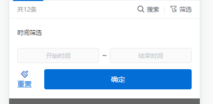

#### 常规筛选


#### 移动端 筛选一

<p style="text-align: center;">
  
</p>

``` html
      <div class="filter">
        <div class="filter-total">共{{ exchangeTotal }}条</div>
        <div class="filter-choose">
          <div class="filter-search" @click="searchJump">
            <i class="iconfont">&#xe6a1;</i>
            <p>搜索</p>
          </div>
          <div class="filter-time" @click="screenShow = true">
            <i class="iconfont">&#xe6c5;</i>
            <p>筛选</p>
          </div>
        </div>
        <div class="filter-pos" v-if="screenShow">
          <div class="period">
            <div class="h3">
              <span>时间筛选</span>
            </div>
            <div class="time">
              <div :style="form.startTime > 0 ? 'color:#303133' : ''" @click.stop="startCalendar(1)">{{ form.startTime > 0 ? $moment(form.startTime * 1000).format('YYYY/MM/DD') : '开始时间' }}</div>
              <span>～</span>
              <div :style="form.endTime > 0 ? 'color:#303133' : ''" @click.stop="startCalendar(2)">{{ form.endTime > 0 ? $moment(form.endTime * 1000).format('YYYY/MM/DD') : '结束时间' }}</div>
            </div>
          </div>
          <div class="reset-action">
            <div class="reset" @click="resetFun">
              <i class="iconfont">&#xe6c7;</i>
              <span>重置</span>
            </div>
            <div class="btn" @click="determine">确定</div>
          </div>
          <div class="mask" @click.stop="filterFun"></div>
        </div>
      </div>

    <van-action-sheet v-model="calendarShow" :closeable="false">
      <div class="time-head">
        <p @click="timeDown">关闭</p>
        <p>{{ form.calendarIndex == 1 ? '开始时间' : '结束时间' }}</p>
        <p @click="timeSubmit">确定</p>
      </div>
      <div class="time-fill">
        <time-picker :dialogVisible="true" timeType="datetime" :timeData="timeData" :disabledDate="disabledDate" @submit="submit"></time-picker>
      </div>
    </van-action-sheet>
```

``` js
export default {
  name: '',
  data() {
    return {

      //筛选
      screenShow: false,
      form: {
        startTime: -1,
        endTime: -1,
        calendarIndex: 1
      },
      formData: {
        startTime: -1,
        endTime: -1,
        calendarIndex: 1
      },
      //时间选择
      calendarShow: false,
      timeData: [],
      timeVal: {},

    }
  },
  created() {},
  mounted() {

  },
  methods: {

    //时间选择筛选
    startCalendar(num) {
      this.form.calendarIndex = num
      this.timeData = []
      if (num == 1 && this.form.startTime > 0) {
        let tiem = new Date(this.form.startTime * 1000)
        this.timeData = [tiem.getFullYear(), tiem.getMonth() + 1, tiem.getDate()]
      } else if (num == 2 && this.form.endTime > 0) {
        let tiem = new Date(this.form.endTime * 1000)
        this.timeData = [tiem.getFullYear(), tiem.getMonth() + 1, tiem.getDate()]
      }
      this.calendarShow = true
    },
    submit(val) {
      console.log(val)
      this.timeVal = val
    },
    timeDown() {
      this.calendarShow = false
      this.timeData = []
    },
    disabledDate(time) {
      if (this.form.startTime <= 0 && this.form.endTime <= 0) {
        return false
      } else {
        if (this.form.calendarIndex == 1) {
          return this.form.endTime > 0 ? new Date(time).getTime() > this.form.endTime * 1000 : false
        } else {
          return this.form.startTime > 0 ? new Date(time).getTime() < this.form.startTime * 1000 : false
        }
      }
    },
    timeSubmit() {
      let time = Math.round(new Date(this.timeVal.year, this.timeVal.month - 1, this.timeVal.day).getTime() / 1000)
      if (this.form.calendarIndex == 1) {
        this.form.startTime = time
      } else {
        this.form.endTime = time
      }
      this.calendarShow = false
      this.timeData = []
    },
    filterFun() {
      this.screenShow = !this.screenShow
      this.form = JSON.parse(JSON.stringify(this.formData))
    },
    //重置筛选
    resetFun() {
      this.form.startTime = -1
      this.form.endTime = -1
      this.form.calendarIndex = 1
      this.timeData = []
    },
    //确定筛选
    determine() {
      this.$store.commit('loadShowFun', true)
      this.screenShow = false
      this.formData = JSON.parse(JSON.stringify(this.form))
      // console.log(this.form)
      // this.exchangePage = 1
      // this.GetOrderInfoListFun(true)
    },


  },

}
``` 
``` css
  .filter {
    width: 100%;
    display: flex;
    align-items: center;
    justify-content: space-between;
    padding: 0 16px;
    line-height: 35px;
    border-bottom: 1px solid #f0f1f3;
    background-color: #ffffff;
    position: relative;
    .filter-total {
      color: #909399;
      font-size: 12px;
    }
    .filter-choose {
      display: flex;
      align-items: center;

      & > div {
        display: flex;
        align-items: center;
        padding-left: 10px;
        margin-left: 10px;
        position: relative;
        p {
          font-size: 12px;
          color: #606266;
          margin-left: 4px;
        }
        i {
          color: #606266;
          font-size: 16px;
        }
      }
      .filter-time::after {
        content: '';
        position: absolute;
        width: 1px;
        height: 14px;
        background-color: #e8e8e8;
        top: calc(50% - 7px);
        left: 0;
      }
    }
    .filter-pos {
      width: 100%;
      position: absolute;
      top: 36px;
      left: 0;
      z-index: 9;
      background-color: #ffffff;
      .h3 {
        display: flex;
        align-items: center;
        justify-content: space-between;
        span {
          font-size: 0.6rem;
          color: #303133;
        }
        i {
          font-size: 0.8rem;
        }
      }
      .period {
        width: 100%;
        padding: 0.5rem 0.8rem 0;
        .time {
          display: flex;
          align-items: center;
          justify-content: space-between;
          margin-top: 0.5rem;
          div {
            width: 47%;
            display: flex;
            align-items: center;
            justify-content: center;
            background: #fafafa;
            border-radius: 0.2rem;
            border: 0.05rem solid #e8e8e8;
            line-height: 1.4rem;
            color: #c0c4cc;
            font-size: 0.6rem;
          }
          span {
            color: #303133;
            font-size: 0.7rem;
          }
        }
      }
      .reset-action {
        width: 100%;
        padding: 0.5rem 0.8rem 0.9rem;
        display: flex;
        align-items: center;
        justify-content: space-between;
        .reset {
          display: flex;
          align-items: center;
          flex-direction: column;
          line-height: 20px;
          i {
            font-size: 0.8rem;
            color: #036ed5;
          }
          span {
            color: #036ed5;
            font-size: 0.7rem;
          }
        }
        .btn {
          width: 84.5%;
          background: #036ed5;
          border-radius: 0.2rem;
          line-height: 2rem;
          text-align: center;
          color: #ffffff;
        }
      }
      .mask {
        position: fixed;
        width: 100%;
        height: 100%;
        background-color: #000000;
        opacity: 0.6;
        left: 0;
      }
    }
  }
```


