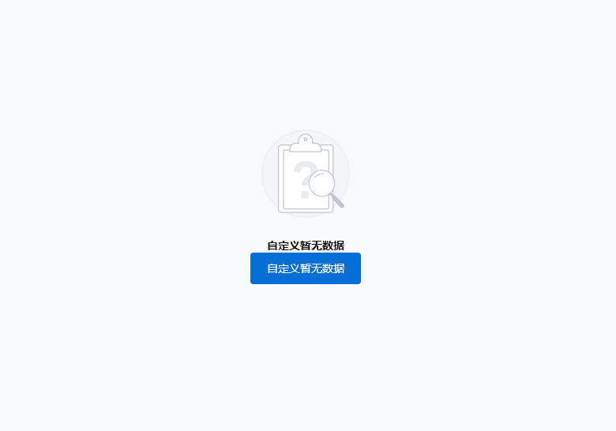

### 图形示例

### 新版暂无数据
```html
    <yy-empty 
        emptyUrl="https://dl-yiyunappclient.effio.cn/resource/common/empty_search.png" 
        :description="暂无数据"
    >
        <div> 
            <h1>支持自定义暂无数据</h1>
            <button>按钮</button>
        </div>
    </yy-empty>
```
| 参数            | 说明          | 类型    |
| --------------- | ------------- | ------- |
| emptyUrl        | 图片地址      | String  |
| description     | 文本信息      | String  |

### 老版暂无数据(v1.2.6版本开始废弃)
```html
    <yiyun-Empty 
        :textList="['暂无数据','请创建']" 
        :emptyUrl="https://dl-yiyunappclient.effio.cn/resource/common/empty_search.png">
    </yiyun-Empty>
```
| 参数            | 说明          | 类型    |
| --------------- | ------------- | ------- |
| emptyUrl        | 图片地址       | String  |
| textList        | 文本信息集合   | Array  |
