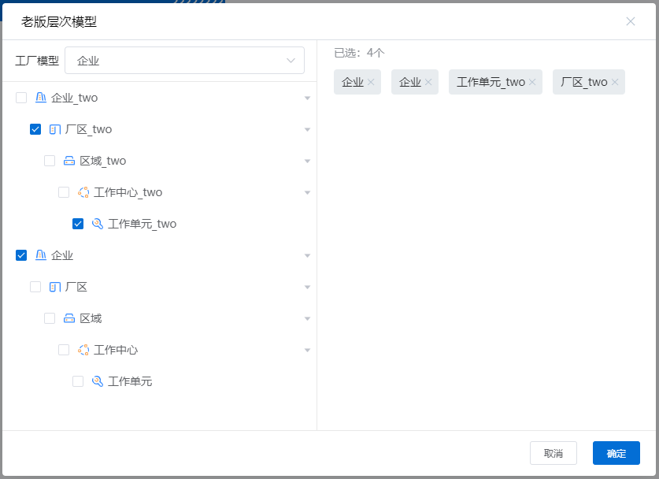

### 新版本层次模型

<ClientOnly>
  <componentsWeb-levelModel-demo />
</ClientOnly>
<!--  -->

#### 引入使用

```html
  <yy-levelModel
    title="新版层次模型"
    :data="levelModels"
    :visible="visible"
    :isSingleCheck="false"
    :checkedIds="['44ZPFcvACBR']"
    :disabledIds="['44ZPFcvACBR','44ZPJ4yQNpo']"
    :visibleNodeTypes="[2,3,4,5]"
    :isNeedCheckAll="false"
    @close="visible = false"
    @confirm="visible = false"
  >
  </yy-levelModel>
```

#### 传入数据

```js
export default {
  name: "yyLevelModel",
  data() {
    return {
      visible: true,
      levelModels: [
        {
          id: "H~00000028",
          name: "工位1-1-1-3",
          parentId: "44ZPKxtM8bZ",
          type: 5,
        },
        {
          id: "H~00000027",
          name: "工位1-1-1-2",
          parentId: "44ZPKxtM8bZ",
          type: 5,
        },
        {
          id: "H~0000001T",
          name: "2.1.1.1.1",
          parentId: "H~0000001S",
          type: 3,
        },
        { id: "H~0000001S", name: "2.1.1.1", parentId: "H~0000001R", type: 3 },
        { id: "H~0000001R", name: "2.1.1", parentId: "H~0000001Q", type: 3 },
        { id: "H~0000001Q", name: "区域2.1", parentId: "3pqHY4b37cj", type: 3 },
        { id: "H~0000001P", name: "区域1", parentId: "3pw9SwVpepF", type: 3 },
        {
          id: "44ZPN1A5qX5",
          name: "工位1-1-1-1",
          parentId: "44ZPKxtM8bZ",
          type: 5,
        },
        {
          id: "44ZPKxtM8bZ",
          name: "新工作中心1-1-1",
          parentId: "44ZPJ4yQNpo",
          type: 4,
        },
        {
          id: "44ZPJ4yQNpo",
          name: "区域1-1",
          parentId: "44ZPFcvACBR",
          type: 3,
        },
        { id: "44ZPFcvACBR", name: "站点1", parentId: "3pqHPjXu82B", type: 2 },
        {
          id: "3pw9ixKohVR",
          name: "亦云工位A-2-2",
          parentId: "3pw9Z1R8fvF",
          type: 5,
        },
        {
          id: "3pw9iChqq5y",
          name: "亦云工位A-2-1",
          parentId: "3pw9Z1R8fvF",
          type: 5,
        },
        {
          id: "3pw9hJouUCP",
          name: "亦云工位A-1-2",
          parentId: "3pw9YRrYvuV",
          type: 5,
        },
        {
          id: "3pw9gfZ6Wxo",
          name: "亦云工位A-1-1",
          parentId: "3pw9YRrYvuV",
          type: 5,
        },
        {
          id: "3pw9ekkdh9Z",
          name: "亦云工位B-2-2",
          parentId: "3pw9axAe3yH",
          type: 5,
        },
        {
          id: "3pw9eDFPxKZ",
          name: "亦云工位B-2-1",
          parentId: "3pw9axAe3yH",
          type: 5,
        },
        {
          id: "3pw9czbGgas",
          name: "亦云工位B-1-2",
          parentId: "3pw9ZzBsAp7",
          type: 5,
        },
        {
          id: "3pw9cNWHfVZ",
          name: "亦云工位B-1-1",
          parentId: "3pw9ZzBsAp7",
          type: 5,
        },
        {
          id: "3pw9axAe3yH",
          name: "亦云工作中心B-2",
          parentId: "3pw9WFuJwoM",
          type: 4,
        },
        {
          id: "3pw9ZzBsAp7",
          name: "亦云工作中心B-1",
          parentId: "3pw9WFuJwoM",
          type: 4,
        },
        {
          id: "3pw9Z1R8fvF",
          name: "亦云工作中心A-2",
          parentId: "3pw9VDjmbFD",
          type: 4,
        },
        {
          id: "3pw9YRrYvuV",
          name: "亦云工作中心A-1",
          parentId: "3pw9VDjmbFD",
          type: 4,
        },
        {
          id: "3pw9WFuJwoM",
          name: "亦云区域B",
          parentId: "3pw9SwVpepF",
          type: 3,
        },
        {
          id: "3pw9VDjmbFD",
          name: "亦云区域A",
          parentId: "3pw9SwVpepF",
          type: 3,
        },
        {
          id: "3pw9SwVpepF",
          name: "亦云厂区",
          parentId: "3pqHPjXu82B",
          type: 2,
        },
        {
          id: "3pqHaCRE8LF",
          name: "工位2-2",
          parentId: "3pqHY4b37cj",
          type: 5,
        },
        { id: "3pqHZ62hKTd", name: "工位2", parentId: "3pqHY4b37cj", type: 5 },
        { id: "3pqHY4b37cj", name: "区域2", parentId: "3pqHPjXu82B", type: 3 },
        { id: "3pqHPjXu82B", name: "产品-亦云-测试", parentId: "", type: 1 },
      ],
    };
  },
};
```

#### 参数说明
| 参数            | 说明          | 类型    | 默认值   |
| --------------- | ------------- | ------- | ------- |
| visible         | 开启或关闭                     | Boolean  | false     |
| title           | 层次模型标题                   | String   | 企业模型  |
| isSingleCheck   | 是否单选模式                   | Boolean  | false     |
| data            | 层次模型数据集合               | Array    | []        |
| checkedIds      | 已选层次模型id集合             | Array    | []        |
| disabledIds     | 禁选层次模型id集合             | Array    | []        |
| visibleNodeTypes| 可见的节点类型,2-5区间连续值</br>例：[2,3]或[3,4]或[5] | Array    | [2,3,4,5] |
| isNeedCheckAll  | 是否需要全选                   | Boolean  | true      |


#### 事件
| 参数            | 说明                    |
| --------------- | ----------------------- |
| confirm         | 点击确定按钮触发，返回选择数据集合 |
| close           | 点击关闭 / 取消按钮触发  |

### 老版本层次模型(v1.2.6版本开始废弃)

#### 引入使用

```html
    <yiyun-levelModel
    title="层次模型自定义标题"
    :isOpen="isOpen_model"
    :levelModelList="levelModelList"
    :choosedList="choosedList"
    :isSingle="isSingle"
    @setSupervisors="setSupervisors"
    @confirm="confirm_model"
    @close="close_model"
    ></yiyun-levelModel>
```

#### 传入数据

```js
export default {
  name: "YiyunLevelModel",
  data() {
    return {
      //true单选  false多选(默认)
      isSingle:false,
      //默认选中层次模型数据
      choosedList: [
        {
          factoryModelId: 6,
          factoryModelName: "企业",
        },
        {
          factoryModelId: 2,
          factoryModelName: "厂区_two",
        },
      ],
      //层次模型弹框 (true打开 false关闭)
      isOpen_model: false,
      //层次模型数据 (api数据直接传入即可)
      levelModelList: [
        {
          factoryModelType: 1,
          factoryModelParentId: null,
          factoryModelId: 1,
          factoryModelName: "企业_two",
          supervisors: [
            {
              supervisorId: 1,
              supervisorName: "张三",
            },
            {
              supervisorId: 2,
              supervisorName: "李四",
            },
          ],
          isCheck: false,
        },
        {
          factoryModelType: 2,
          factoryModelParentId: 1,
          factoryModelId: 2,
          factoryModelName: "厂区_two",
          supervisors: [],
          isCheck: false,
        },
        {
          factoryModelType: 3,
          factoryModelParentId: 2,
          factoryModelId: 3,
          factoryModelName: "区域_two",
          supervisors: [],
          isCheck: false,
        },
        {
          factoryModelType: 4,
          factoryModelParentId: 3,
          factoryModelId: 4,
          factoryModelName: "工作中心_two",
          supervisors: [],
          isCheck: false,
        },
        {
          factoryModelType: 5,
          factoryModelParentId: 4,
          factoryModelId: 5,
          factoryModelName: "工作单元_two",
          supervisors: [],
          isCheck: false,
        },
        {
          factoryModelType: 1,
          factoryModelParentId: null,
          factoryModelId: 6,
          factoryModelName: "企业",
          supervisors: [],
          isCheck: false,
        },
        {
          factoryModelType: 2,
          factoryModelParentId: 6,
          factoryModelId: 7,
          factoryModelName: "厂区",
          supervisors: [
            {
              supervisorId: 3,
              supervisorName: "王五",
            },
          ],
          isCheck: false,
        },
        {
          factoryModelType: 3,
          factoryModelParentId: 7,
          factoryModelId: 8,
          factoryModelName: "区域",
          supervisors: [],
          isCheck: false,
        },
        {
          factoryModelType: 4,
          factoryModelParentId: 8,
          factoryModelId: 9,
          factoryModelName: "工作中心",
          supervisors: [],
          isCheck: false,
        },
        {
          factoryModelType: 5,
          factoryModelParentId: 9,
          factoryModelId: 10,
          factoryModelName: "工作单元",
          supervisors: [],
          isCheck: false,
        },
      ],
    };
  },
  methods: {
    //点击设置负责人按钮
    setSupervisors(item){
      console.log('要设置负责人的节点信息',item)
    },
    //点击确认按钮
    confirm_model(choosedList) {
      console.log("被选择成员", choosedList);
    },
    //点击关闭按钮
    close_model() {
      this.isOpen_model = false;
    },
  },
};
```
#### 参数说明
| 参数            | 说明          | 类型    | 默认值   |    可选值    |
| --------------- | ------------- | ------- | ------- | ------------ | 
| isOpen          | 开启或关闭                     | Boolean  | false   | false:关闭，true:开启 | 
| title           | 弹框标题                       | String   | "选择位置" | —                  | 
| isSingle        | 是否单选模式                   | Boolean  | false   | false:多选，true:单选 | 
| isSetSupervisors| 是否设置负责人                 | Boolean  | false   | false:不可设置负责人，true:可设置负责人 | 
| levelModelList  | 层次模型数据集合               | Array    | []      | 接口数据传入即可      | 
| choosedList     | 已选数据集合                   | Array    | []      | [{id:'',name:''}]     |

#### 事件
| 参数            | 说明                    |
| --------------- | ----------------------- |
| confirm         | 点击确定按钮触发，返回选择数据集合  |
| close           | 点击关闭 / 取消按钮触发  |
| setSupervisors  | 点击设置负责人按钮触发   |