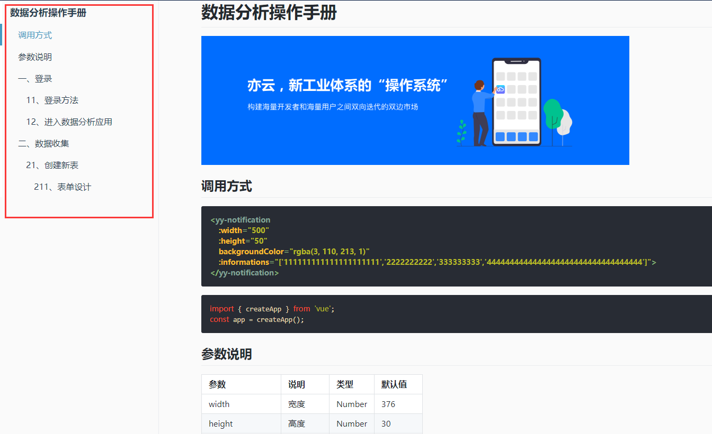

### 图形示例

### 调用方式

```html
<yy-MarkdownDirectory :el="el"></yy-MarkdownDirectory>
```
```js
this.el = this.$refs['markdown-body']
```
```html
<div class="markdown-body" ref="markdown-body">
    <h1 id="数据分析操作手册">数据分析操作手册</h1>
    <p>
        
    </p>
    <h2 id="调用方式">调用方式</h2>
    <pre><code class="html language-html hljs xml"><span class="hljs-tag">&lt;<span class="hljs-name">yy-notification</span> 
    <span class="hljs-attr">:width</span>=<span class="hljs-string">"500"</span> 
    <span class="hljs-attr">:height</span>=<span class="hljs-string">"50"</span> 
    <span class="hljs-attr">backgroundColor</span>=<span class="hljs-string">"rgba(3, 110, 213, 1)"</span> 
    <span class="hljs-attr">:informations</span>=<span class="hljs-string">"['111111111111111111111','2222222222','333333333','4444444444444444444444444444444444']"</span>&gt;</span>
    <span class="hljs-tag">&lt;/<span class="hljs-name">yy-notification</span>&gt;</span></code></pre>
    <pre><code class="js language-js hljs javascript"><span class="hljs-keyword">import</span> { createApp } <span class="hljs-keyword">from</span> <span class="hljs-string">'vue'</span>;
    <span class="hljs-keyword">const</span> app = createApp();</code></pre>
    <h2 id="参数说明">参数说明</h2>
    <h2 id="一、登录">一、登录</h2>
    <h3 id="11、登录方法">1.1、登录方法</h3>
    <p>
        登录地址：<a
        href="https://staging-admin.tsescloud.com/pc/platform/login/login.html，输入地址后会出现如下页面"
        >https://staging-admin.tsescloud.com/pc/platform/login/login.html，输入地址后会出现如下页面</a
        >
    </p>
    <p></p>
    <center>登录界面</center>
    <p></p>
    <p>
        注：系统支持chrome内核，建议使用谷歌浏览器，如果是其他浏览器（除IE外），请设置极速模式，如上图红框位置
    </p>
    <p>
        打开登录界面后输入用户名（手机号）、密码、验证码，点击登录就可以进入亦云主页面
    </p>
    <h3 id="12、进入数据分析应用">1.2、进入数据分析应用</h3>
    <p></p>
    <center>亦云主页面</center>
    <p></p>
    <p>点击亦云主页面红框处的【数据分析】进入数据分析应用</p>
    <p>数据分析应用分为数据收集和数据分析2个模块</p>
    <p>数据收集模块用来创建表单并收集数据</p>
    <p>数据分析模块用来将各表单的数据进行关联并生成报表</p>
    <h2 id="二、数据收集">二、数据收集</h2>
    <h3 id="21、创建新表">2.1、创建新表</h3>
    <p></p>
    <center>数据收集界面</center>
    <p></p>
    <p>创建表单分为2种方式：</p>
    <ul>
        <li>
        <p>通过表单设计器自定义建表，点击【创建新表】进入表单设计界面</p>
        </li>
        <li>
        <p>导入本地EXCEL表格快速建表，点击【导入新表】进入表单导入界面</p>
        </li>
    </ul>
    <h4 id="211、表单设计">2.1.1、表单设计</h4>
    <p>
        <br />
        右连接，以右边的表即表2的企业名称为主，得到的结果为：
    </p>
</div>
```
### 参数说明
| 参数            | 说明          | 类型    |
| --------------- | ------------- | ------- |
| el              | markdown转换成html标签后的最外层dom元素    | HTMLElement |