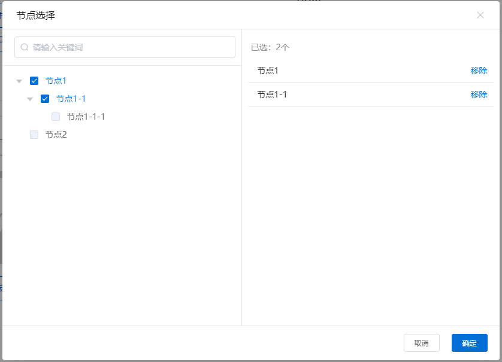

### 引入使用

```html
  <yy-nodeCheck
    title="节点选择"
    :data="nodes"
    :visible="visible"
    :isSingleCheck="false"
    :checkedIds="[1,3]"
    :disabledIds="[2,4]"
    @close="visible = false"
    @confirm="visible = false"
  >
    <template v-slot:customNode="{ node }">
        <div>{{node}}</div>
    </template>
  </yy-nodeCheck>
```

### 传入数据

```js
export default {
  name: "yyNodeCheck",
  data() {
    return {
      visible: true,
      nodes: [
        { id: 1, name: "节点1" },
        { id: 2, name: "节点2" },
        { id: 3, name: "节点1-1", parentId:1 },
        { id: 4, name: "节点1-1-1",parentId:3 },
      ],
    };
  },
};
```

### 参数说明
| 参数            | 说明          | 类型    | 默认值   |   可选值 |
| --------------- | ------------- | ------- | ------- | ------------ | 
| visible         | 开启或关闭                 | Boolean  | false     | false:关闭，true:开启 | 
| title           | 标题                       | String   | 企业模型  | —                  | 
| isSingleCheck   | 是否单选模式               | Boolean  | false     | false:多选，true:单选 | 
| data            | 节点数据集合               | Array    | []        | 格式：[{ id: 3, name: "节点1-1", parentId:1 }] | 
| checkedIds      | 已选层次模型id集合             | Array    | []    | ['id1','id2']     |
| disabledIds     | 禁选层次模型id集合             | Array    | []    | ['id1','id2']     |
| v-slot:customNode="{ node }"   | 自定义节点内容，详见下文  | Object   | {}    |  |
 
### 事件
| 参数            | 说明                    |
| --------------- | ----------------------- |
| confirm         | 点击确定按钮触发，返回选择数据集合 |
| close           | 点击关闭 / 取消按钮触发  |

### slot
| 参数            | 说明                    |
| --------------- | ----------------------- |
| v-slot:customNode="{ node }" | {"id": 1,"name": "节点1","parentId": 2,"children": [],"disabled": true,"checked": false,"expanded": true} |
