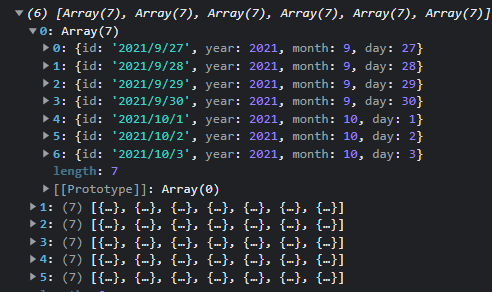

获取指定年月的日历数据集
### 获取日历简易数据

#### 调用方式
```js
    this.$Calendar.getCalendarData(year,month)
```
#### 使用示例
```js
    this.$Calendar.getCalendarData(2021,10)
```
### 获取日历非简易数据

#### 调用方式
```js
    this.$Calendar.getCalendarComplexData(year,month)
```
#### 使用示例
```js
    this.$Calendar.getCalendarComplexData(2021,10)
```
#### 参数说明
| 参数            | 说明          | 类型    |
| --------------- | ------------- | ------- |
| year            | 年份          | Number  |
| month           | 月份          | Number  |

### 函数片段
``` js
 getMonthDays(year, month) {
        return new Date(year, month, 0).getDate()
    }
    getWeekDayOfMonthFirstDay(year, month) {
        return new Date(year, month - 1, 1).getDay()
    }
    getCalendarData(year, month) {
        const days = this.getMonthDays(year, month)
        const weekDay = this.getWeekDayOfMonthFirstDay(year, month) === 0 ? 7 : this.getWeekDayOfMonthFirstDay(year, month)
        const CalendarData = new Array(6).fill(0).map(v => [0, 0, 0, 0, 0, 0, 0])
        const fillCount_row_1 = 7 - weekDay + 1
        const fillCount_row_2 = 7
        const fillCount_row_3 = 7
        const fillCount_row_4 = 7
        const fillCount_row_5 = days - fillCount_row_1 - 7 * 3 >= 7 ? 7 : days - fillCount_row_1 - 7 * 3
        const fillCount_row_6 = days - fillCount_row_1 - 7 * 4 > 0 ? days - fillCount_row_1 - 7 * 4 : 0
        let prevMonthDays = this.getMonthDays(year, month - 1)

        for (let i = 7 - fillCount_row_1 - 1; i >= 0; i--) {
            CalendarData[0][i] = prevMonthDays
            prevMonthDays--
        }
        let day = 1
        for (let i = 7 - fillCount_row_1; i < 7; i++) {
            CalendarData[0][i] = day
            day++
        }
        for (let i = 0; i < fillCount_row_2; i++) {
            CalendarData[1][i] = day
            day++
        }
        for (let i = 0; i < fillCount_row_3; i++) {
            CalendarData[2][i] = day
            day++
        }
        for (let i = 0; i < fillCount_row_4; i++) {
            CalendarData[3][i] = day
            day++
        }
        for (let i = 0; i < fillCount_row_5; i++) {
            CalendarData[4][i] = day
            day++
        }
        for (let i = 0; i < fillCount_row_6; i++) {
            CalendarData[5][i] = day
            day++
        }
        let nextMonthDays = 1
        for (let i = 0; i < 7 - fillCount_row_5; i++) {
            CalendarData[4][fillCount_row_5 + i] = nextMonthDays
            nextMonthDays++
        }
        for (let i = 0; i < 7 - fillCount_row_6; i++) {
            CalendarData[5][fillCount_row_6 + i] = nextMonthDays
            nextMonthDays++
        }
        return CalendarData
    }
    getCalendarComplexData(year_now, month_now) {
        let calendarData = this.getCalendarData(year_now, month_now)
        const _calendarData = []
        calendarData.forEach((row, index) => {
            if (index === 0) {
                row = row.map((day) => {
                    let year = year_now;
                    let month = month_now;
                    if (day > 7) {
                        if (month === 1) {
                            year--;
                            month = 12;
                        } else {
                            month--;
                        }
                    }
                    return {
                        id: `${year}/${month}/${day}`,
                        year: year,
                        month: month,
                        day: day,
                    };
                });
            } else if (index === 4) {
                row = row.map((day) => {
                    let year = year_now;
                    let month = month_now;
                    if (day < 8) {
                        if (month === 12) {
                            year++;
                            month = 1;
                        } else {
                            month++;
                        }
                    }
                    return {
                        id: `${year}/${month}/${day}`,
                        year: year,
                        month: month,
                        day: day,
                    };
                });
            } else if (index === 5) {
                row = row.map((day) => {
                    let year = year_now;
                    let month = month_now;
                    if (day < 15) {
                        if (month === 12) {
                            year++;
                            month = 1;
                        } else {
                            month++;
                        }
                    }
                    return {
                        id: `${year}/${month}/${day}`,
                        year: year,
                        month: month,
                        day: day,
                    };
                });
            } else {
                row = row.map((day) => {
                    let year = year_now;
                    let month = month_now;
                    return {
                        id: `${year}/${month}/${day}`,
                        year: year,
                        month: month,
                        day: day,
                    };
                });
            }
            _calendarData.push(row);
        });
        return _calendarData;        
    }
```