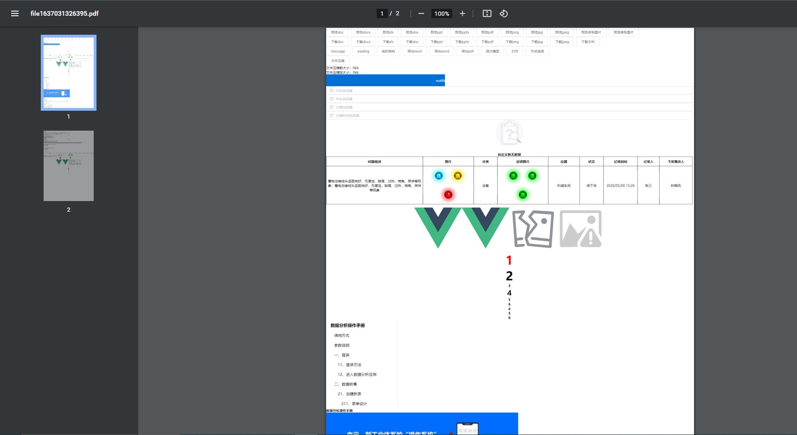

### 示例

```js
    //show loading
    await this.$exportWord({
        dom: document.getElementById("export-area"),
        fileName: "test",
    });
    //hide loading
```
| 参数            | 说明          | 类型    |   默认   |
| --------------- | ------------- | ------- | -------  |
| dom             | 导出的内容（必传）      | HTMLElement | - |
| fileName        | pdf文件名称,无需加.pdf文件类型  | String   | file + timestamp |