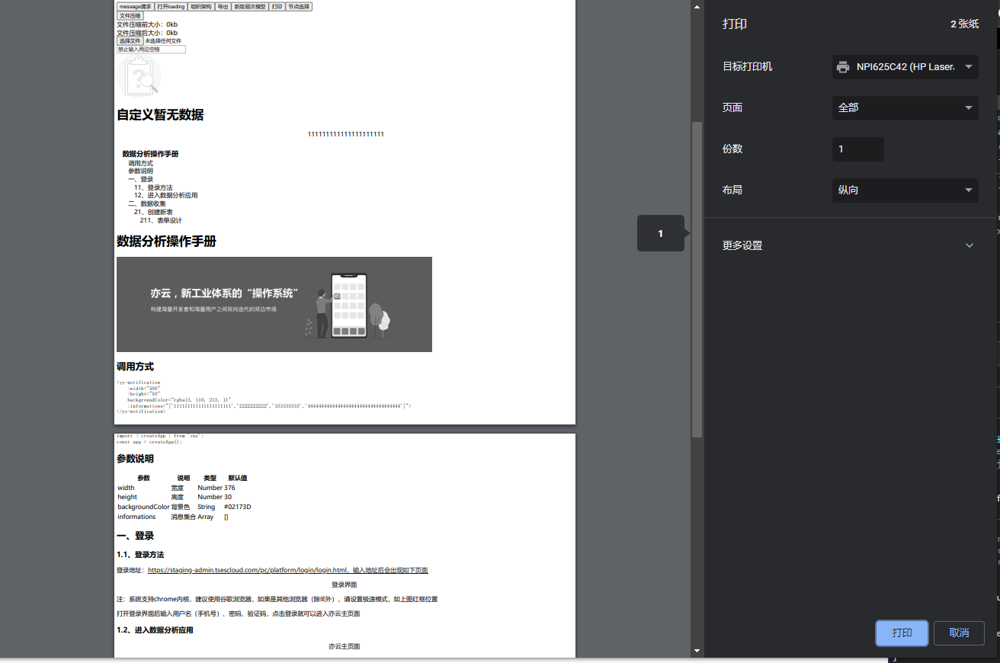

### 图形示例


### 使用示例
```html
<div ref="print-dom" id="print-dom">
    <div class="print-container">
        <h1>1</h1>
        <h2>2</h2>
        <h3>3</h3>
    </div>
    <div class="print-container">
        <h1>4</h1>
        <h2>5</h2>
        <h3>6</h3>
    </div>
</div> 
```
```js
const dom = document.getElementById("print-dom")
// < v1.4.3
this.$print(dom);
// >= v1.4.3
this.$print({printDom:dom,style:"",pageType:"A4",pageLayout:"column"});
```
### 参数说明 >= v1.4.2
| 参数名 | 参数说明 | 参数类型 |
| :---:  | :---: | :---: |
| printDom   | 想要打印的区域（必传）   | HTMLElement |
| style      | 打印区域的样式（非必传） | String |
| pageType   | 打印纸张类型：A3/A4/A5等（非必传） | String |
| pageLayout | 打印纸张布局：row 或 column（非必传） | String |

:::warning
传入pageType或pageLayout的任意一项值，会导致很多打印设置无法自定义。

所以根据需求来决定是否传入pageType和pageLayout
:::

### 参数说明 < v1.4.2
| 参数名 | 参数说明 | 参数类型 |
| :---: | :---: | :---: |
| dom   | 想要打印的区域（必传） | HTMLElement |
| style | 打印区域的样式（非必传） | String |


