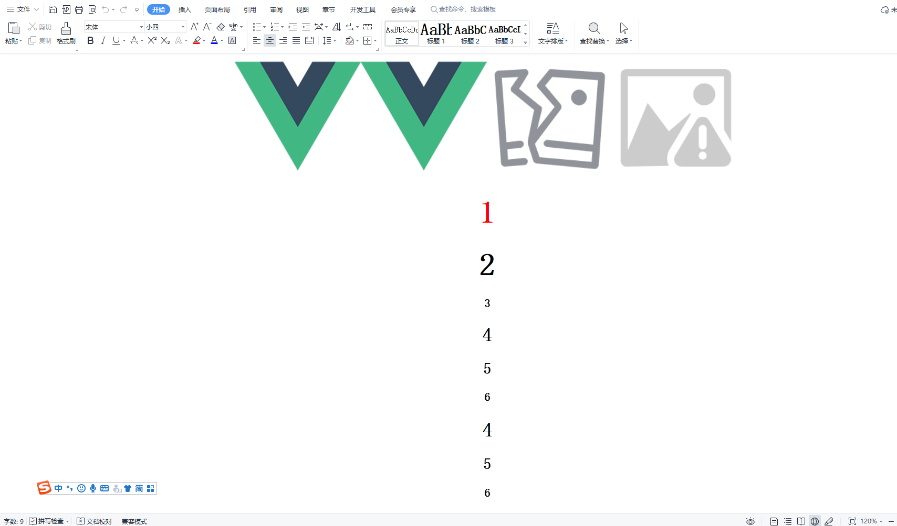

### 示例

```js
    //show loading
    await this.$exportWord({
        dom: document.getElementById("export-area"),
        style:'<style type="text/css"> #export-area {text-align: center;} </style>',
        fileName: "test",
        fileType: "doc",
    });
    //hide loading
```
| 参数            | 说明          | 类型    |   默认   |
| --------------- | ------------- | ------- | -------  |
| dom             | 导出的内容（必传）      | HTMLElement | - |
| style           | 导出内容的样式          | String    | "" |
| fileName        | word文件名称            | String   | file + timestamp |
| fileType        | word文件类型 docx 或 doc            | String   | docx |