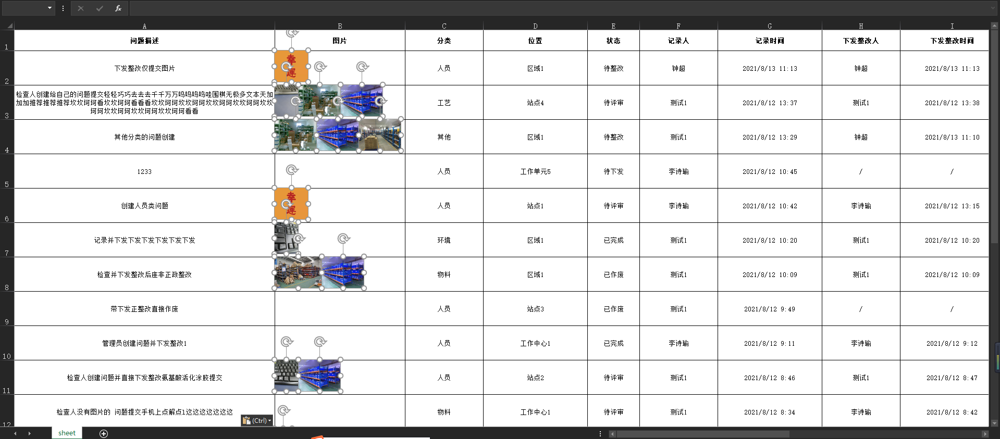

### 图形示例

### 满足现阶段所有需求（包含以下两个方法的功能）

```js
const res = await this.$exportExcelGrid({
  fileName: "导出文件",
  rowHeights: [60, 70, 80, 90, 100],
  colWidths: [200, 250, 80, 80, 80],
  grids: [
    [
      {
        value: 1,
        isUrl: false,
        isImage: false,
        backgroundColor: "FFFFFF00",
        fontSize: 15,
        fontColor: "FF036ED5",
        fontBold: true,
      },
      {
        value: 2,
        backgroundColor: "FFC3CBDD",
        textAlign: "center",
        textVertical: "middle",
        textWrap: true,
        textIndent: 0,
        fontSize: 11,
        fontColor: "FF000000",
        fontBold: false,
      },
      {
        value: 3,
        textAlign: "center",
        textVertical: "middle",
        textWrap: true,
        textIndent: 0,
        fontSize: 11,
        fontColor: "FF000000",
        fontBold: false,
      },
      {
        value: files.img1,
        isImage: true,
        textAlign: "center",
        textVertical: "middle",
        textWrap: true,
        textIndent: 0,
        fontSize: 11,
        fontColor: "FF000000",
        fontBold: false,
      },
      {
        value: files.img2,
        isImage: true,
        textAlign: "center",
        textVertical: "middle",
        textWrap: true,
        textIndent: 0,
        fontSize: 11,
        fontColor: "FF000000",
        fontBold: false,
      },
      {
        value:
          "https://dl-yiyunappclient.effio.cn/resource/common/imageNull.png",
        isUrl: true,
        isImage: false,
        textAlign: "left",
        textVertical: "middle",
        textWrap: false,
        textIndent: 0,
        fontSize: 11,
        fontColor: "FF000000",
        fontBold: false,
      },
    ],
    [
      { value: 7 },
      { value: 8 },
      { value: 9 },
      { value: 10 },
      { value: 11 },
    ],
    [
      { value: 12 },
      { value: 13 },
      { value: 14 },
      { value: 15 },
      { value: 16 },
    ],
    [
      { value: 17 },
      { value: 18 },
      { value: 19 },
      { value: 20 },
      { value: 21 },
    ],
    [
      { value: 22 },
      { value: 23 },
      { value: 24 },
      { value: 25 },
      { value: 26 },
    ],
    [
      { value: 27 },
      { value: 28 },
      { value: 29 },
      { value: 30 },
      { value: 31 },
    ],
  ],
  merges: ["A1:C1", "A4:A6", "C3:E3"],
  exportImmediately: true,
});
```
### 参数说明
| 参数            | 说明             | 类型    |  可选值  |  默认值  |
| --------------- | ---------------- | ------- | -------  | ------- |
| fileName        | excel文件名称    | String  |  -       | 导出文件 | 
| rowHeights      | 行高集合         | Array   |  -       |  [80,80,80,...]      |
| colWidths       | 列宽集合         | Array   |  -       |  [161,161,161,...]      |
| grids           | 数据集合         | Array   |  -       |  []      |
| merges          | 单元格合并集合   | Array   |  -       |  []      |
| exportImmediately | 是否立即导出excel文件 | Boolean  |  true/false  |  true     |

### grids字段说明
| 参数            | 说明             | 类型    |  可选值  |  默认值  |
| --------------- | ---------------- | ------- | -------  | ------- |
| value           | 单元格值         |    any  |  -       |     ""   |
| isUrl           | 是否为超链接      | Boolean  |  true/false |    false   |
| isImage         | 是否为图片        | Boolean  |  true/false |    false   |
| textAlign       | 文本水平对齐方式  | String  |  left/center/right  | center |
| textVertical    | 文本垂直对齐方式  | String  |  top/middle/bottom  | middle |
| textWrap        | 文本溢出是否换行  | Boolean |  true/false   |  false |
| textIndent      | 文本缩进          | Number  |  -       |  0      |
| fontSize        | 字体大小          | Number  |  -       |  11     |
| fontColor       | 字体颜色(ARGB值)  | String  |  -       |  FF000000  |
| fontBold        | 字体是否加粗      | Boolean |  true/false  |  false |
| backgroundColor | 背景颜色(ARGB值)  | String  |  -       |  FFFFFFFF  |
### 支持直接导出图片
```js
const res = await this.$exportExcelIncludeBase64({
        fileName: "导出模板",
        tableHead: [            
            "问题描述",
            "图片",
            "图片",
            "图片",
            "分类",
            "反馈图片",
            "反馈图片",
            "位置",
            "状态",
            "记录时间",
            "记录人",
            "下发整改人"
        ],
        tableBody: [
          [
            "蓄电池接线头坚固完好，无腐蚀、脱落、过热、烧焦、异味等现象",
            imageBase64,
            imageBase64,
            imageBase64,
            "设备",
            imageBase64,
            imageBase64,
            "机械车间",
            "待下发",
            "2020/05/06 15:26",
            "张三",
            "时璐凤",
          ],
        ],
        colStyles: [
            { width: 510, textAlign: 'left', textVertical: "middle", textWrap: false, textIndent: 1, fontSize: 16, fontColor: 'FF00FF00', fontBold: true, },
            { width: 82, textAlign: 'center', textVertical: "middle", textWrap: true, textIndent: 0, },
            { width: 82, textAlign: 'center', textVertical: "middle", textWrap: true, textIndent: 0, },
            { width: 82, textAlign: 'center', textVertical: "middle", textWrap: true, textIndent: 0, },
            { width: 123, textAlign: 'center', textVertical: "middle", textWrap: true, textIndent: 0, },
            { width: 82, textAlign: 'center', textVertical: "middle", textWrap: true, textIndent: 0, },
            { width: 82, textAlign: 'center', textVertical: "middle", textWrap: true, textIndent: 0, },
            { width: 164, textAlign: 'center', textVertical: "middle", textWrap: true, textIndent: 0, },
            { width: 124, textAlign: 'center', textVertical: "middle", textWrap: true, textIndent: 0, },
            { width: 161, textAlign: 'center', textVertical: "middle", textWrap: true, textIndent: 0, },
            { width: 113, textAlign: 'center', textVertical: "middle", textWrap: true, textIndent: 0, },
            { width: 173, textAlign: 'center', textVertical: "middle", textWrap: true, textIndent: 0, },
        ],
        rowHeight: 80,
        tableHeadMerges: [{mergeStart:2,mergeCols:3},{mergeStart:6,mergeCols:2}],
        exportImmediately:true
      })
```
| 参数            | 说明          | 类型    |
| --------------- | ------------- | ------- |
| fileName        | excel文件名称                   | String   |
| tableHead       | excel表头                       | Array    |
| tableBody       | excel表体                       | Array    |
| colWidth(废弃)  | excel表列宽                     | Array    |
| colStyles       | excel表列样式                   | Array    |
| rowHeight       | excel表体行高                   | Number   |
|tableHeadMerges  | 表头合并集合                 | Array     |
|exportImmediately| 是否立即导出excel文件        | Boolean   |
### 图片超链接形式导出
```js
    const res = await this.$exportExcel({
        fileName: "导出模板",
        tableHead: [            
            "问题描述",
            "图片",
            "图片",
            "图片",
            "分类",
            "反馈图片",
            "反馈图片",
            "位置",
            "状态",
            "记录时间",
            "记录人",
            "下发整改人"
        ],
        tableBody: [
          [
            "蓄电池接线头坚固完好，无腐蚀、脱落、过热、烧焦、异味等现象",
            "https://dl-yiyunappclient.effio.cn/resource/common/imageNull.png",
            "https://dl-yiyunappclient.effio.cn/resource/common/imageNull.png",
            "https://dl-yiyunappclient.effio.cn/resource/common/imageNull.png",
            "设备",
            "https://dl-yiyunappclient.effio.cn/resource/common/imageNull.png",
            "https://dl-yiyunappclient.effio.cn/resource/common/imageNull.png",
            "机械车间",
            "待下发",
            "2020/05/06 15:26",
            "张三",
            "时璐凤",
          ],
        ],
        colStyles: [
            { width: 510, textAlign: 'left', textVertical: "middle", textWrap: false, textIndent: 1, fontSize: 16, fontColor: 'FF00FF00', fontBold: true, },
            { width: 82, textAlign: 'center', textVertical: "middle", textWrap: true, textIndent: 0, },
            { width: 82, textAlign: 'center', textVertical: "middle", textWrap: true, textIndent: 0, },
            { width: 82, textAlign: 'center', textVertical: "middle", textWrap: true, textIndent: 0, },
            { width: 123, textAlign: 'center', textVertical: "middle", textWrap: true, textIndent: 0, },
            { width: 82, textAlign: 'center', textVertical: "middle", textWrap: true, textIndent: 0, },
            { width: 82, textAlign: 'center', textVertical: "middle", textWrap: true, textIndent: 0, },
            { width: 164, textAlign: 'center', textVertical: "middle", textWrap: true, textIndent: 0, },
            { width: 124, textAlign: 'center', textVertical: "middle", textWrap: true, textIndent: 0, },
            { width: 161, textAlign: 'center', textVertical: "middle", textWrap: true, textIndent: 0, },
            { width: 113, textAlign: 'center', textVertical: "middle", textWrap: true, textIndent: 0, },
            { width: 173, textAlign: 'center', textVertical: "middle", textWrap: true, textIndent: 0, },
        ],
        rowHeight: 80,
        tableHeadMerges: [{mergeStart:2,mergeCols:3},{mergeStart:6,mergeCols:2}],
        exportImmediately:true
      })
```
| 参数            | 说明          | 类型    |
| --------------- | ------------- | ------- |
| fileName        | excel文件名称                   | String   |
| tableHead       | excel表头                       | Array    |
| tableBody       | excel表体                       | Array    |
| colWidth(废弃)  | excel表列宽                     | Array    |
| colStyles       | excel表列样式                   | Array    |
| rowHeight       | excel表体行高                   | Number   |
|tableHeadMerges  | 表头合并集合                 | Array     |
|exportImmediately| 是否立即导出excel文件        | Boolean   |


<!-- | mergeStart(废弃)| 从表头的哪一列开始合并，mergeCols<2，则不生效  | Number   |
| mergeCols(废弃) | 需要合并的表头列数，mergeCols<2，则不需要合并  | Number   | -->

### colStyles字段说明
| 参数            | 说明             | 类型    |  可选值  |  默认值  |
| --------------- | ---------------- | ------- | -------  | ------- |
| width           | 列宽             | Number  |  -       |  161    |
| textAlign       | 文本水平对齐方式  | String  |  left/center/right  | center |
| textVertical    | 文本垂直对齐方式  | String  |  top/middle/bottom  | middle |
| textWrap        | 文本溢出是否换行  | Boolean |  true/false   |  false |
| textIndent      | 文本缩进          | Number  |  -       |  0      |
| fontSize        | 字体大小          | Number  |  -       |  11     |
| fontColor       | 字体颜色(ARGB值)  | String  |  -       |  FF000000  |
| fontBold        | 字体是否加粗      | Boolean |  true/false   |  false    |


<!-- ### 附带样式的xlsx文件和附带HTML代码的txt文件(v1.2.6版本开始废弃)
```js
    const res = await this.$exportExcelLoyoutAndTxt({
        fileName: "导出文件",
        tableHead: [
          "问题描述",
          "图片",
          "分类",
          "反馈图片",
          "位置",
          "状态",
          "记录时间",
          "记录人",
          "下发整改人",
        ],
        tableBody: [
            "蓄电池接线头坚固完好，无腐蚀、脱落、过热、烧焦、异味等现象；蓄电池接线头坚固完好，无腐蚀、脱落、过热、烧焦、异味等现象",
            "",
            "设备",
            "",
            "机械车间",
            "待下发",
            "2020/05/06 15:26",
            "张三",
            "时璐凤",
        ],
        colWidth: [510, 250, 123, 250, 124, 161, 113, 173, 173],
        rowHeight: 80,
        exportImmediately: true,
      })
```
| 参数            | 说明          | 类型    |
| --------------- | ------------- | ------- |
| fileName        | excel文件名称                   | String   |
| tableHead       | excel表头                       | Array    |
| tableBody       | excel表体                       | Array    |
| colWidth        | excel表列宽                     | Array    |
| rowHeight       | excel表体行高                   | Number   |
|exportImmediately| 是否立即导出excel文件        | Boolean   | -->