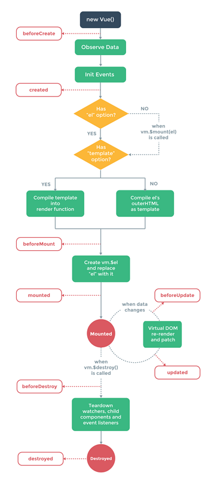

# 介绍 vue2.x和vue3.x


### 2.x

##### 什么是生命周期函数，在某一时刻会自动执行的函数


</img>


``` js
    beforeCreate(){
        //在实例生成之前会自动执行函数
    }
    created(){
        //在实例生成之后会自动执行函数
    }
    beforeMount(){
        //在模板渲染完成前执行的函数
    }
    mounter(){
        //在模板渲染完成后执行的函数
    }
    beforeUpdate(){
        //在data()里面的值改变之前执行的函数
    }
    Update(){
        //在data()里面的值改变之后执行的函数
    }
    beforeDestroy(){
        // Vue实例的生命周期结束前执行
    }
    destroyed(){
        //在Vue实例的生命周期结束后执行。
    }
```

##### v-once   一次渲染不渲染第二次

##### 模板动态参数

``` js
    data(){
        return{
            name:'title1',
            message:'js',
            event:'click'
        }
    },
    template:`
        <h2 :[name]="js" @[event]="ent"></h2>
    `
```

##### 模板修饰符 prevent (阻止默认事件) stop （防止事件冒泡） capture （与事件冒泡的方向相反，事件捕获由外到内） self （只会触发自己范围内的事件，不包含子元素）


##### 计算属性的特性

``` js 

    conputed:{ // 当计算属性的依赖的内容发生改变时才会重新计算

    },
    methods:{//只要页面重新渲染，就会重新执行方法

    },

```

### 按键和鼠标修饰符 

``` js
    // @keyup.xxxx
    // .delete    delete（删除）/BackSpace（退格）
    // .tab    Tab
    // .enter    Enter（回车）
    // .esc    Esc（退出）
    // .space    Space（空格键）
    // .left    Left（左箭头）
    // .up    Up（上箭头）
    // .right    Right（右箭头）
    // .down    Down（下箭头）
    // .ctrl    Ctrl
    // .alt    Alt
    // .shift    Shift
    // .meta    (window系统下是window键，mac下是command键)

    // 组合写法    按键组合
    // @keyup.alt.67=”function”    Alt + C
    // @click.ctrl=”function”    Ctrl + Click
    // @keyup.ctrl.c=”function”    Ctrl + C
    // @keyup.ctrl.c+@keyup.c=”function”    Ctrl + C

    // @click 鼠标按钮修饰符
    // .left　　点击鼠标左键即可触发事件
    // .right　　点击鼠标右键即可触发事件
    // .middle　　按下滑轮触发事件
    // .native 【自定义组件】 使用自定义组件，添加点击事件时，当自定义组件渲染后，自定义组件内部的原生dom取代组件在页面上渲染后，导致添加的事件找不到承载方而引起事件失效（native 会让事件转载到自定义组件的最外层标签上）
    // .stop 【阻止冒泡事件】 防止dom冒泡，没什么可说的，子dom点击事件执行后就停止，阻止父dom的事件也执行（阻止单击事件继续传播）
    // .prevent 【针对form表单提交】提交事件不再重载页面，组织form表单提交导致页面刷新
    // .capture 【暂时不知道什么场景用】 添加事件监听器时使用事件捕获模式，即元素自身触发的事件先在此处理，然后才交由内部元素进行处理，和正常的事件传输模式相反
    // .self 【阻止子dom事件和stop相似，stop是添加在子dom，self是添加在父dom】只当在 event.target 是当前元素自身时触发处理函数，即事件不是从内部元素触发的
    // .once 【按钮事件只被执行一次】点击事件将只会触发一次
    // .passive 【页面的滚动事件】 滚动事件的默认行为 (即滚动行为) 将会立即触发，而不会等待


```

### v-model 修饰符
``` js
    // .lazy 懒加载修饰符
    // .number 修饰符让其转换为 number 类型
    // .trim 修饰符可以自动过滤掉输入框的首尾空格。
```

### 父调用子的函数
``` js
    //父调用子的函数 有多种方法
    this.$refs.child.fun();
```
### 子调用父的函数
``` js
    //子调用父的函数 一有多种方法
    this.$parent.fun(); //$parent 可能是多层的

```
### 过滤器
``` js
   filters: {
    //过滤器：（使用时没有参数，即{{msg|filterA}}）
    filterA(value) {
      return value + ','
    }
  },

```


### 3.x


##### 生命周期函数
``` js
    steUp(){
        //在实例生成之前,可代替beforeCreate，created
    }
    onBeforeMount(() =>{
        console.log('组件挂载到页面之前onBeforeMount')
    })
    onMounted(() =>{
      console.log('组件挂载页面之后onMounted')
    })
    onBeforeUpdate(() =>{
      console.log('组件更新之前onBeforeUpdate')
    })
    onUpdated(() =>{
      console.log('组件更新之后onBeforeUpdate')
    })
    onBeforeUnmount(() =>{
        console.log('组件卸载之前onBeforeUnmount')
    })
    onUnmounted(() =>{
        console.log('组件卸载之后onBeforeUnmount')
    })
    onActivated(() =>{
        console.log('在<keep-alive></keep-alive>里面才有')
    })
    onDeactivated(() =>{
        console.log('比如从 A 组件，切换到 B 组件，A 组件消失时执行。')
    })
    onErrorCaptured(() =>{
        console.log('当捕获一个来自子孙组件的异常时激活钩子函数')
    })
    onRenderTracked(() =>{
        console.log('状态跟踪，它会跟踪页面上所有响应式变量和方法的状态，也就是我们用return返回去的值，他都会跟踪。只要页面有update的情况，他就会跟踪，然后生成一个event对象，我们通过event对象来查找程序的问题所在。')
    })
    onRenderTriggered(() =>{
        console.log('它不会跟踪每一个值，而是给你变化值的信息，并且新值和旧值都会给你明确的展示出来。')
    })
```

##### Teleport方法

``` html
    <template>
        <teleport to="#modal">
            <div id="center">
            <h2>JSPang11</h2>
            </div>
        </teleport>
    </template>
    //然后我们在打开/public/index.html,增加一个model节点。
    <div id="app"></div>
    <div id="modal"></div>
    //这时候在浏览器中预览，就会发现，现在组件已经挂载到model节点上了，这就是teleport组件的使用了。
```


##### Suspense异步请求组件

``` html
    <template>
        <div>
            <Suspense>
                <template #default>
                    <h1>删除001</h1>
                </template>
                <template #fallback>
                    <h1>Loading...</h1>
                </template>
            </Suspense>
        </div>
    </template>
    <!--可以看到Suspense是有两个template插槽的，第一个default代表异步请求完成后，显示的模板内容。fallback代表在加载中时，显示的模板内容。-->
```