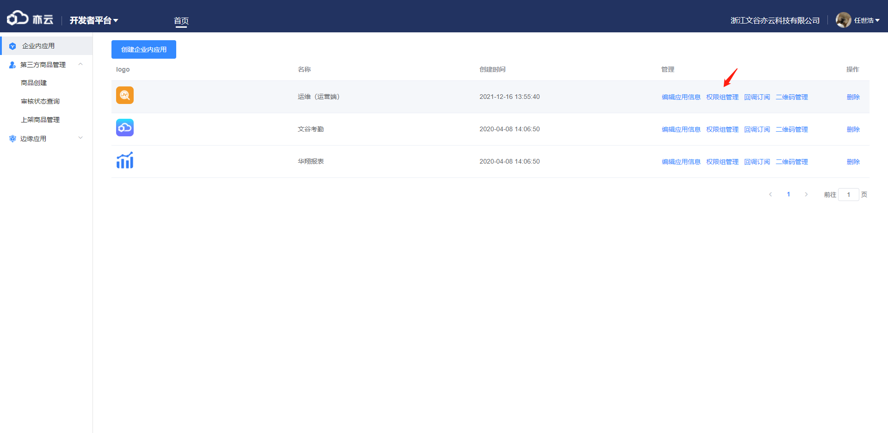
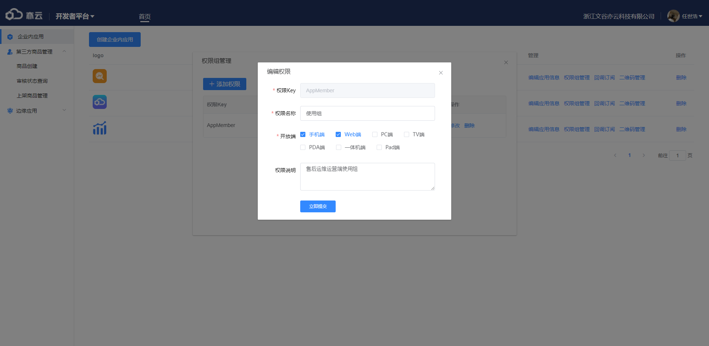

以运维（运营端）为例

1、首先进入商品创建后台，点击企业内应用的【创建企业内应用】按钮

2、填写基础信息：
应用Logo，必填；
应用名称，必填；
应用分类，必填，选择一个；
勾选所需的端，调试地址填写后端给你的对应端的地址（ <a href="https://staging-yiyunappmg.effio.cn/opsmobile/index.html" target="_blank">例如https://staging-yiyunappmg.effio.cn/opsmobile/index.html</a>），不要填本地，此地址由前端打完包发给后端，后端自行上传服务器后将链接给你，是否对全员开发一般选择关闭（选中任何人可见，不选则需配置权限组）；
</img>

3、将AppKey和AppSecret发给后端，第三方应用新建也如此。
点击保存修改
</img>
4、点击权限组管理
</img>
5、默认无任何权限组，第三方应用默认有一个权限组，点击添加权限
</img>
权限Key，填写权限key名（英文），后续不可修改；
权限名称，填写权限名称（中文）；
开放端，勾选想开发的端；
权限说明，描述该权限，可不填；
多权限每个权限也如此配置。
</img>
与第三方应用最大区别，传包不是自己传给服务端，而是打包给后端，然后在调试地址填写后端给的地址，另外，企业内应用不用更新，即时生效。