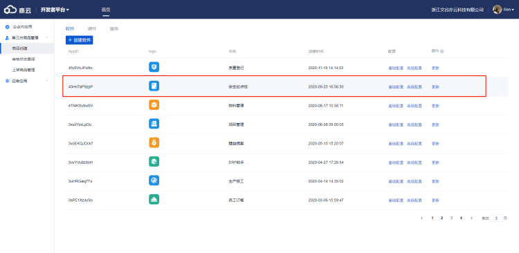
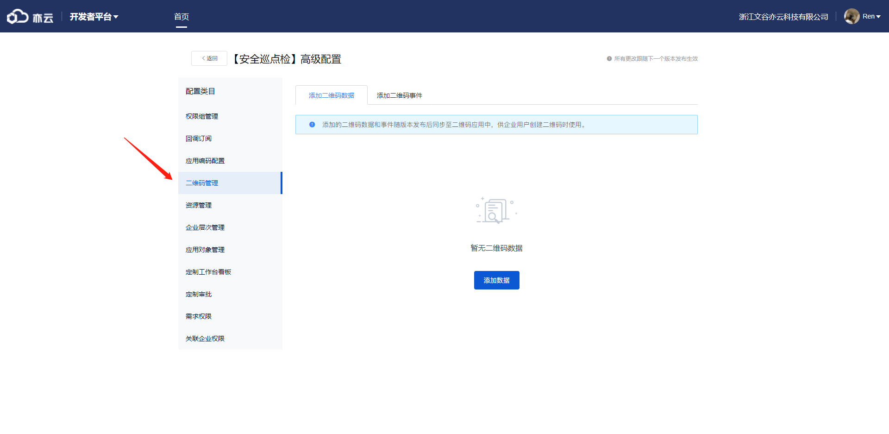
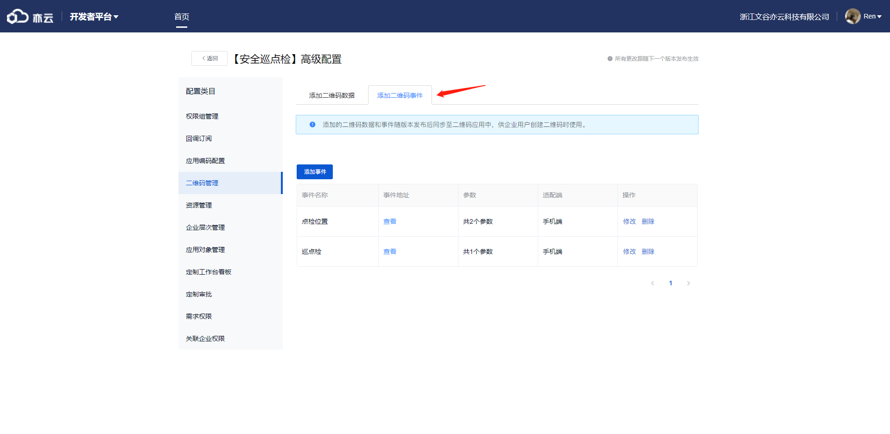
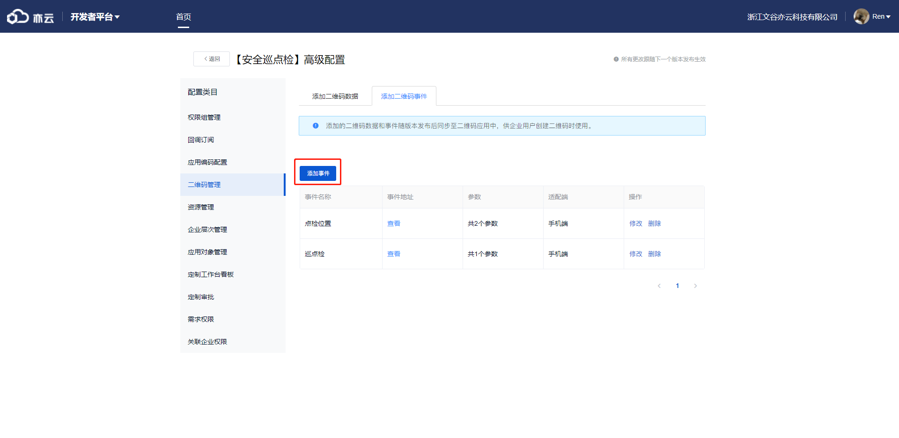
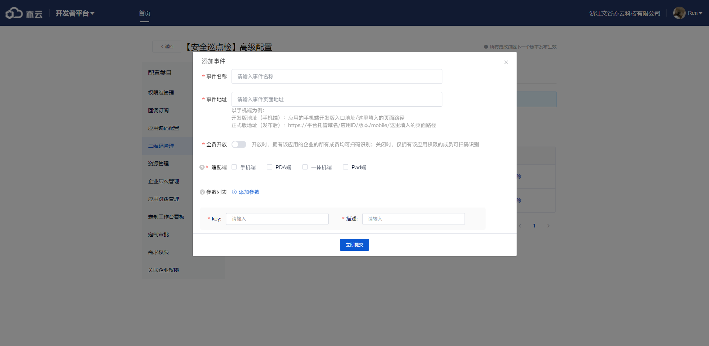

以安全巡点检为例

1、首先进入商品创建后台，找到对应应用
</img>
2、点击高级设置后点击二维码管理
</img>
3、点击添加二维码事件
</img>
4、点击添加事件
</img>
5、以下讲解参数配置：
事件名称填写二维码事件名称；
事件地址填写默认跳转路由地址（例如#/home/home-index），一定要以#/开头，不然hash模式路由有问题；
全员开放默认关，一般都需要打开；
适配端，勾选需要跳转的端，一般只勾选移动端；
参数列表，点击添加参数。
</img>
6、以下讲解参数列表添加参数配置：
key，二维码的键值；
描述，对该key的描述，可与key重复；
7、二维码配置需等下次更新后生效。
8、具体使用参考《移动端新版二维码对接》这篇文章