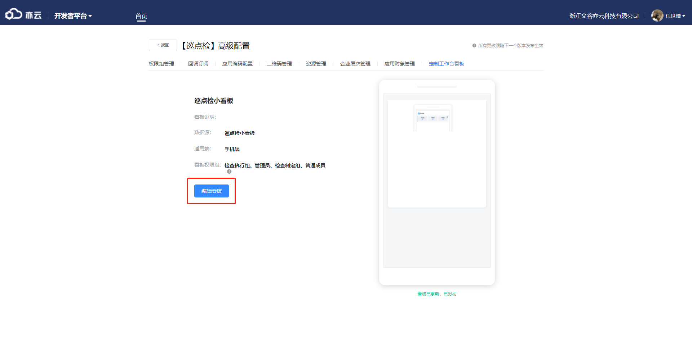
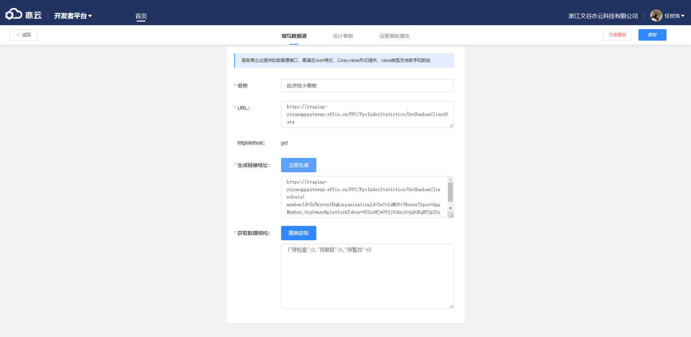

以巡点检为例

1、首先进入商品创建后台，找到对应应用
</img>
2、点击高级设置后点击定制工作台看板
</img>
3、点击创建看板，已创建点击编辑看板
</img>

4、以下讲解参数配置：
填写数据源中名称为看板名称；
URL由请求地址+接口地址构成（<a href="https://staging-yiyunappgateway.effio.cn/PPC/PpcIndexStatistics/GetKanbanClientData" target="_blank">例如：https://staging-yiyunappgateway.effio.cn/PPC/PpcIndexStatistics/GetKanbanClientData</a>，它的构成是https://staging-yiyunappgateway.effio.cn + /PPC/PpcIndexStatistics/GetKanbanClientData），接口由后端提供；
（统计图数据接口示例：<a href="https://staging-api.effio.cn/kanban/KbDevelop/Test" target="_blank">例如：https://staging-api.effio.cn/kanban/KbDevelop/Test</a>
生成链接地址在填完URL后点击生成，不可修改；
获取数据结构点击后生成，也不可修改
</img>
5、设计看板，默认只有应用标题，将统计磁贴拉入看板获取以下效果；
</img>
点击磁贴打开右侧面板，背景色，字段颜色及位置根据情况调整，字段配置默认都是同一个，可下拉更改；
</img>
点击交互配置磁贴各字段链接，#前填写打包出的html文件名，#后填写页面路由及参数，上限都为50字；
</img>
点击应用标题也可配置链接，与上述一致
</img>
6、点击设置看板属性：
看板名称就是填写数据源时填写的名称；
看板说明字面意思，可不填；
看板权限设置，勾选可看到小看板成员权限，权限组为当前应用权限组；
看板预览图自己上传，默认空，必填。
</img>
7、最后点击保存，小看板需等下次更新后生效。