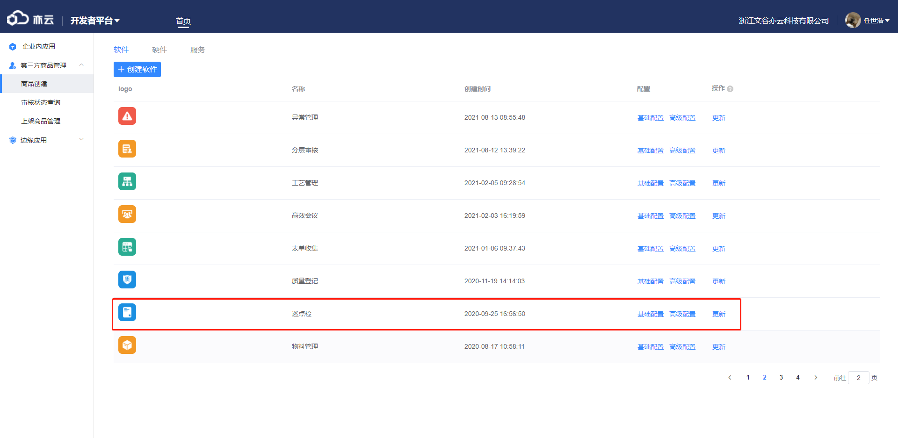
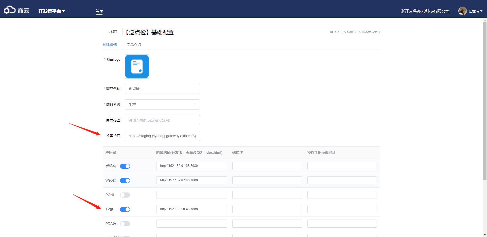
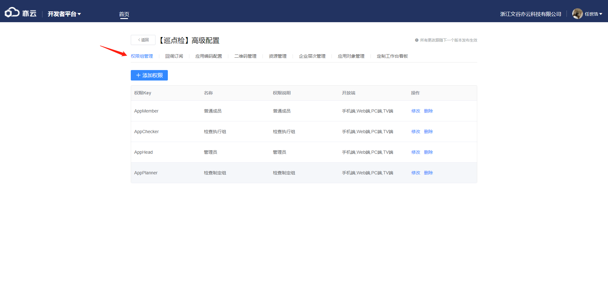
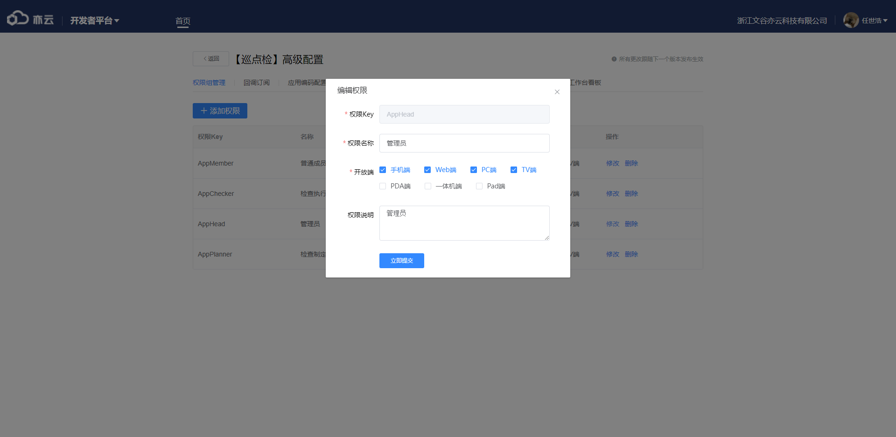
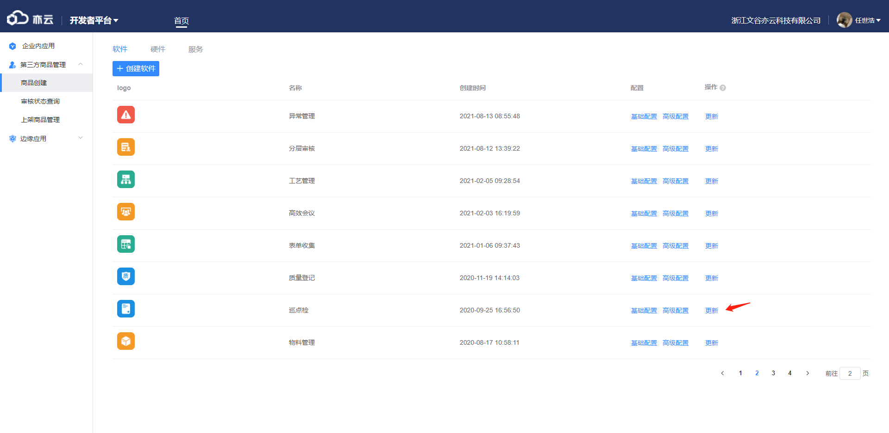
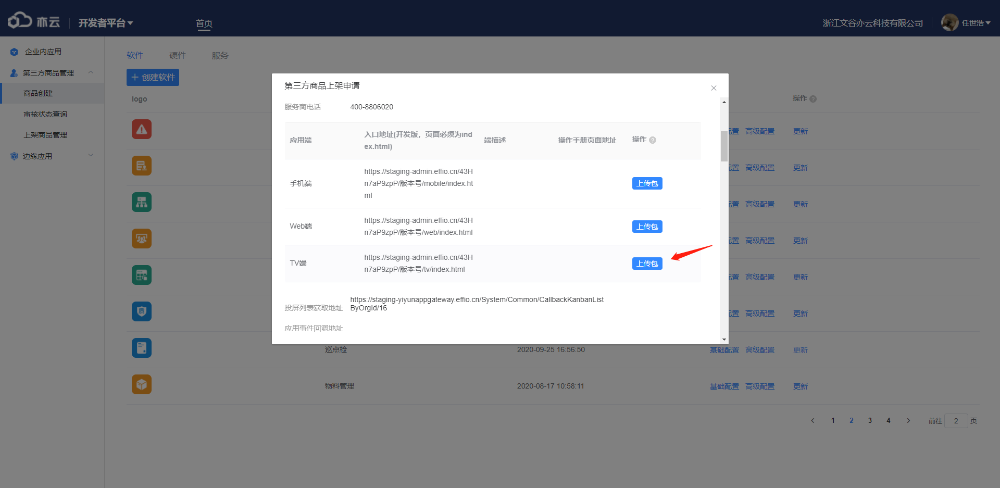

仍以巡点检为例

1、首先进入商品创建后台，找到对应应用
</img>
2、点击基础设置后填写对应数据：
投屏接口填写，由请求地址+接口地址+appType构成（例如：<a href="https://staging-yiyunappgateway.effio.cn/System/Common/CallbackKanbanListByOrgId/16" target="_blank">例如：https://staging-yiyunappgateway.effio.cn/System/Common/CallbackKanbanListByOrgId/16</a>，它的构成是https://staging-yiyunappgateway.effio.cn + /System/Common/CallbackKanbanListByOrgId + 16）；
TV端按钮开启，调试地址填写本地运行地址（一般为IP地址+端口）。
点击保存修改
</img>
3、点击高级配置进入权限组管理：
</img>
为需要的权限组勾选上TV端，例如下图
</img>
4、点击更新可为TV端上传包

</img>
</img>